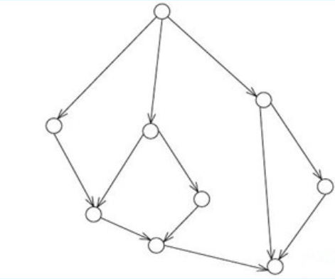
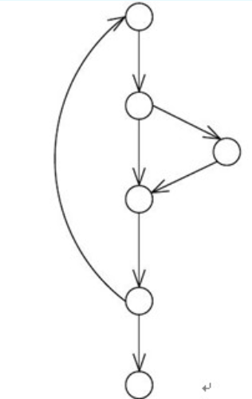
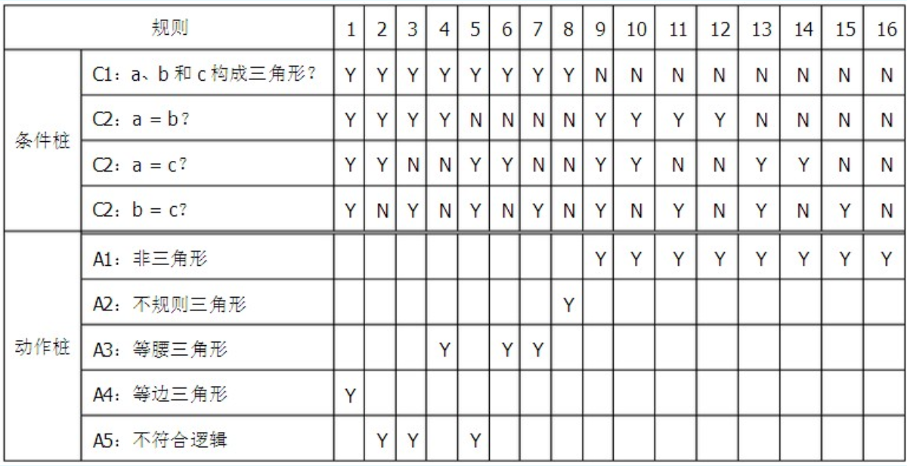
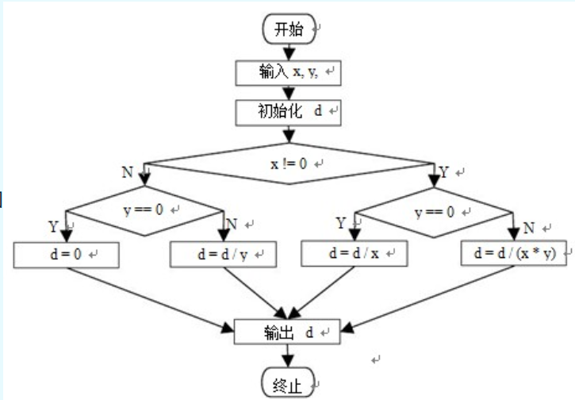
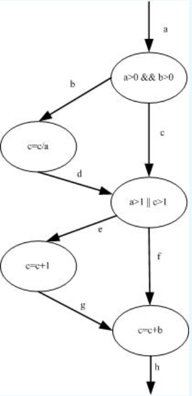
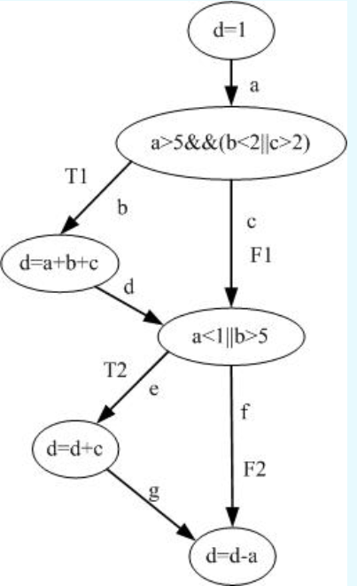

# 软件测试第四次测试

## 题目 1 - 语句覆盖

针对下面的程序，满足100%语句覆盖的测试用例（a,b的值）为（    ）。

```pseudocode
If (a>0 and b>5) Then
    c=a+b
end if

If (a>5 or b>10) Then
    c=a-b
end if
```

**选择一项：**

A. a=10, b=4  
B. a=6, b=6  
C. a=2, b=1  
D. a=-2, b=12

---

## 题目 2 - 逻辑覆盖关系

针对逻辑覆盖有下列叙述，（     ）是不正确的。

**选择一项：**

A. 达到 100％CC 要求就一定能够满足 100％SC 的要求  
B. 达到 100％CDC 要求就一定能够满足 100％SC 的要求  
C. 达到 100％MCDC 要求就一定能够满足 100％SC 的要求  
D. 达到 100％DC 要求就一定能够满足 100％SC 的要求

---

## 题目 3 - 判定覆盖

针对以下 C 语言程序段，对于(MaxNum，Type)的取值，至少需要（    ）个测试用例能够满足判定覆盖的要求。

```c
while ( MaxNum-- > 0 )
{ 
    if ( 10 == Type )
        x = y * 2;
    else
        if ( 100 == Type )
            x = y - 20;    
}
```

**选择一项：**

A. 3  
B. 5  
C. 4  
D. 2

---

## 题目 4 - 等价类划分

下面关于等价类的说法错误的是（    ）。

**选择一项：**

A. 等价类划分只应用于系统测试  
B. 等价类划分可以分为两种基本类型的数据：有效数据和无效数据  
C. 等价类划分也可以基于输出、内部值、时间相关的值以及接口参数等进行  
D. 等价类技术属于基于说明的测试技术

---

## 题目 5 - 判定覆盖

针对下面的程序代码，至少需要多少个测试用例才能满足100%的判定覆盖率？（   ）

```c
/* 输入1到10之间的偶数  */
#include<stdio.h>
int main()
{
    int i=1;
    while(i<=10)
    {
        if(i%2==0)
        {
            printf("%d",i);
        }
        i++;
    }
    return 0;
}
```

**选择一项：**

A. 1  
B. 2  
C. 3  
D. 4

---

## 题目 6 - 语句覆盖与判定覆盖

针对下面的程序段：

```pseudocode
If(x>0 and y>0) then
    z=z/x
end if
if(x>1 or z>1) then
    z=z+1
end if
z=y+z
```

满足100%语句覆盖率和满足100%判定覆盖率的最有效的测试为（    ）。

- （1）x=2, y=1, z=6
- （2）x=1, y=0, z=1
- （3）x=0, y=6, z=6
- （4）x=0, y=12, z=6

**选择一项：**

A. （2）；（1）（2）  
B. （1）（2）（3）；（1）  
C. （1）；（1）（2）  
D. （1）（2）；（2）（3）（4）

---

## 题目 7 - 基于结构的测试技术

以下不属于基于结构的技术的共同特点的是 （     ）

**选择一项：**

A. 使用正式或非正式的模型来描述需要解决的问题  
B. 可以通过已有的测试用例测量软件的测试用例覆盖率  
C. 根据软件的结构信息设计测试用例  
D. 通过系统化地导出设计用例来提高覆盖率

---

## 题目 8 - 决策表测试

下面关于决策表测试的描述错误的是（    ）。

**选择一项：**

A. 当被测对象的行为由一些逻辑条件决定时，可应用决策表测试技术  
B. 决策表描绘了状态和输入之间的关系，并能显示可能的无效状态转换  
C. 决策表的优点是可以生成测试条件的各种组合，而这些组合可能是利用其他方法无法被测试到的  
D. 决策表的每一列对应了一个业务规则，该规则定义了各种条件的一个特定组合


某公司用来计算不同工作年限的员工年终奖系统的需求描述如下：员工在公司的工作年限不超过3年，年终奖为月工资的25%；员工在公司的工作年限超过3年，年终奖为月工资的50%；员工在公司的工作年限超过5年，年终奖为月工资的75%；工作年限超过8年，年终奖为月工资的100%。员工工作年限必须是整型，并且最大值不超过100。  

根据上午规格说明，为“工作年限”划分等价类，得到的有效等价类的数量为(   )。

试题 9选择一项：

A.

4

B.

2

C.

6

D.

8


下面关于测试设计技术的描述错误的是（   ）

试题 10选择一项：

A.

白盒测试设计技术是基于分析被测组件或系统的结构的测试技术

B.

黑盒测试设计技术是依据分析测试基础文档来选择测试条件、测试用例或测试数据的技术

C.

系统测试使用黑盒测试技术，不会使用白盒测试技术

D.

使用测试设计技术的目的是为了识别测试条件和开发测试用例


以下控制流程图的环路复杂性 V(G)等于（    ） 。

graph TD    A["①"]    B["②"]    C["③"]    D["④"]    E["⑤"]    F["⑥"]    G["⑦"]    H["⑧"]    I["⑨"]     A --> B    A --> C    A --> D    B --> E    C --> E    C --> F    D --> G    D --> I    E --> H    F --> H    H --> I    G --> I



选择一项：

A.

4

B.

5

C.

6

D.

3


以下所示程序控制流程图中有（    ）条线性无关的基本路径。

graph TD    N1["1"]    N2["2"]    N3["3"]    N4["4"]    N5["5"]    N6["6"]     N1 --> N2    N2 --> N3    N2 --> N4    N3 --> N4    N4 --> N5    N5 --> N6    N5 -.->|弧形回边| N1



选择一项：

A.

1

B.

4

C.

2

D.

3


测试用例根据参与人员的经验和知识来编写；测试人员、开发人员、用户和其他的利益相关者对软件、软件使用和环境等方面所掌握的知识作为信息来源之一；对可能存在的缺陷及其分布情况的了解作为另一个信息来源。上述测试设计技术属于（   ）。

试题 13选择一项：

A.

白盒测试

B.

基于经验的测试

C.

黑盒测试

D.

基于结构的测试


某原始决策表如下：

| 分类   | 规则                     | 1  | 2  | 3  | 4  | 5  | 6  | 7  | 8  | 9  | 10 | 11 | 12 | 13 | 14 | 15 | 16 | | ------ | ------------------------ | -- | -- | -- | -- | -- | -- | -- | -- | -- | -- | -- | -- | -- | -- | -- | -- | | 条件桩 | C1: a、b和c构成三角形？  | Y  | Y  | Y  | Y  | Y  | Y  | Y  | Y  | N  | N  | N  | N  | N  | N  | N  | N  | |        | C2: a = b？              | Y  | Y  | Y  | Y  | N  | N  | N  | N  | Y  | Y  | Y  | Y  | N  | N  | N  | N  | |        | C2: a = c？              | Y  | Y  | N  | N  | Y  | Y  | N  | N  | Y  | Y  | N  | N  | Y  | Y  | N  | N  | |        | C2: b = c？              | Y  | N  | Y  | N  | Y  | N  | Y  | N  | Y  | N  | Y  | N  | Y  | N  | Y  | N  | | ------ | ------------------------ | -- | -- | -- | -- | -- | -- | -- | -- | -- | -- | -- | -- | -- | -- | -- | -- | | 动作桩 | A1: 非三角形             |    |    |    |    |    |    |    |    | Y  | Y  | Y  | Y  | Y  | Y  | Y  | Y  | |        | A2: 不规则三角形         |    |    |    |    |    |    |    | Y  |    |    |    |    |    |    |    | |        | A3: 等腰三角形           |    |    |    | Y  |    | Y  | Y  |    |    |    |    |    |    |    |    | |        | A4: 等边三角形           | Y  |    |    |    |    |    |    |    |    |    |    |    |    |    |    | |        | A5: 不符合逻辑           |    | Y  | Y  |    | Y  |    |    |    |    |    |    |    |    |    |    |



表中的规则可能存在一定的冗余，如对其进行优化，得到的最有决策表的规则有（    ）条？

 

 

试题 14选择一项：

A.

6

B.

7

C.

8

D.

5


假定A、B为布尔变量，对于逻辑表达式（A && B），至少需要（    ）个测试用例才能完成MCDC覆盖。

试题 15选择一项：

A.

2

B.

3

C.

4

D.

1


针对以下程序段，对于变量C的取值，至少需要（   ）个测试用例才能满足语句覆盖的要求。

  c = ((u8_t *)q->payload)[i];

  switch(c)

{

 case SLIP_END:

   sio_send(SLIP_ESC,netif->state);

   sio_send(SLIP_ESC_END,netif->state);

   break;

 case SLIP_ESC:

​    sio_send(SLIP_ESC,netif->state);

   sio_send(SLIP_ESC_ESC,netif->state);

   break;

 default:

   sio_end(c, netif->state);

   break;

};

试题 16选择一项：

A.

3

B.

4

C.

1

D.

2


针对下列程序段，对于(A，B)的取值，以下哪个测试用例组合能够满足条件覆盖的要求。（   ）

IF ( ( A - 10 ) = 20 AND ( B + 20 ) > 10 ) THEN C = 0

IF ( ( A - 30 ) < 10 AND ( B - 30 ) < 0 ) THEN B = 30

①A=50  B=-10  ②A=40  B=40  ③A=30  B=-10  ④A=30  B=30 

试题 17选择一项：

A.

③④ 

B.

①②

C.

①④

D.

②④


公司定义的员工工资范围的下限为2000元/月，上限为51999元/月，工资为整数，那么员工工资的边界值为（   ）。

试题 18选择一项：

A.

1999，51998

B.

2000，51999

C.

1999，51998

D.

2000，51998


阅读下列流程图

graph TD    S["开始"] --> A["输入 x,y"]    A --> B["初始化 d"]    B --> C{x != 0 ?}    %% x不等于0 为Y分支    C -- Y --> D{y == 0 ?}    D -- Y --> E["d = d / x"]    D -- N --> F["d = d / (x * y)"]    %% x等于0 为N分支    C -- N --> G{y == 0 ?}    G -- Y --> H["d = 0"]    G -- N --> I["d = d / y"]    %% 汇总输出    E --> O["输出 d"]    F --> O    H --> O    I --> O    O --> END["终止"]



当用判定覆盖法进行测试时，至少需要设计（   ） 个测试用例。

试题 19选择一项：

A.

2

B.

4

C.

6

D.

8


根据下图所示的源代码控制流图，为了达到100%的语句覆盖率，最少需要设计多少测试用例？（    ）

graph TD    Start["入口"] --> N1{a>0 && b>0}    %% 分支b：条件不成立    N1 --b(不满足) --> N2["c = c/a"]    %% 分支c：条件成立    N1 --c(满足) --> N3{a>1 || c>1}    N2 --d --> N3    %% N3分支    N3 --e(不满足) --> N4["c = c+1"]    N3 --f(满足) --> N5["c = c+b"]    N4 --g --> N5    N5 --h --> End["出口"]



选择一项：

A.

1个

B.

4个

C.

3个

D.

2个


根据下图所示的源代码控制流程图，为了满足100%的判定覆盖率，至少需要多少测试用例？（    ）

graph TD    A["d=1"] -->|a| B{a>5&&(b<2||c>2)}    B --T1-->|b| C["d=a+b+c"]    B --F1-->|c| D{a<1||b>5}    C --d--> D    D --T2-->|e| E["d=d+c"]    D --F2-->|f| F["d=d-a"]    E --g--> F



选择一项：

A.

2个

B.

1个

C.

4个

D.

3个


系统化的测试主要会受哪些因素的影响？（    ）

（1）组织的架构

（2）测试及开发过程的成熟度

（3）项目时间的限制

（4）安全或规范需求

（5）参与的人员

试题 22选择一项：

A.

（1）（2）（3）（4）（5）

B.

（1）（2）

C.

（2）（3）（4）

D.

（1）（3）（4）（5）


下面哪个属于基于结构测试技术的特点？（    ）

 

试题 23选择一项：

A.

测试用例根据参与人员的经验和知识来获得

B.

根据软件的结构信息获取测试用例,比如软件代码和软件设计

C.

可以通过已有的测试用例测量软件的测试覆盖率，并通过系统化导出设计测试用例来提高测试覆盖率

D.

使用正式或者非正式的模型来描述需要解决的问题或者软件


某个程序有三个输入参数A、B和C，输入参数的有效条件是A<=B和C>=B，如果应用等价类划分的技术，只考虑单缺陷组合（无效等价类只能与有效等价类组合），（       ）组最适合做此程序的健壮性测试（用无效的数据进行的测试）。

（1）A>B，C<B

（2）A>B，C>=B

（3）A<=B，C>=B

（4）A<=B，C<B

试题 24选择一项：

A.

（1）（2）（3）（4）

B.

（2）（3）

C.

（1）（2）（4）

D.

（2）（4）


在某大学学籍管理信息系统中，假设学生年龄的输入范围为 16～40，则根据黑

盒测试中的等价类划分技术，下面划分正确的是 （   ）。

试题 25选择一项：

A.

可划分为 2 个有效等价类，1 个无效等价类

B.

可划分为 1 个有效等价类，2 个无效等价类

C.

可划分为 1 个有效等价类，1 个无效等价类

D.

 可划分为 2 个有效等价类，2 个无效等价类